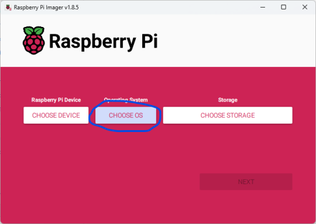
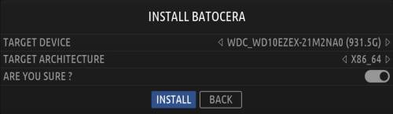

# Installation Guide

비디오 가이드를 선호하는 사람들을 위해 ETA Prime의 훌륭한 비디오 가이드가 있습니다:

Batocera를 [x86_64 컴퓨터](https://wiki.batocera.org/choose_a_desktop_computer)에 설치하는 경우 [오래된 저렴한 PC를 에뮬레이션 드림 머신으로 바꿔보세요](https://www.youtube.com/watch?v=KUfHAFyjby0)! (18:27의 독립 실행형 에뮬레이터에 대한 컨트롤러 구성은 오래되었습니다. 이제 Batocera가 컨트롤러 구성을 처리합니다. 에뮬레이터별 컨트롤을 사용자 정의하려면 [이 페이지](https://wiki.batocera.org/remapping_controls_per_emulator)를 확인하세요.)
[단일 보드 컴퓨터](https://wiki.batocera.org/choose_a_single_board_computer)에 Batocera를 설치하는 경우 [Raspberry Pi 4 전체 설정 가이드에 Batocera를 설치하세요 - Retro Gaming Goodness](https://www.youtube.com/watch?v=5Jr-0UjgC8I)!

> [지원 장치 페이지](https://wiki.batocera.org/devices)에서 Batocera가 어떤 장치에서 실행을 지원하는지 확인할 수 있습니다!


대부분의 플랫폼에 대한 일반적인 지침은 다음과 같습니다.

1. [Raspberry Pi Imager](https://www.raspberrypi.com/software/) 또는 [USBImager](https://gitlab.com/bztsrc/usbimager)와 같은 운영 체제에 맞는 이미지 플래싱 도구를 다운로드하세요. 이 지침에서는 Raspberry Pi Imager를 사용합니다.  
   

2. [Batocera 웹사이트의 다운로드 섹션](https://batocera.org/#download)에서 Batocera에 사용하려는 아키텍처와 일치하는 이미지 파일을 다운로드합니다(대부분의 PC에서는 x86_64, 기타 장치에는 일반적으로 고유한 특정 이미지가 있음).
    > Chrome/Opera/Safari와 같은 일부 브라우저에서는 스스로 파일의 압축을 풀고 이름을 제대로 바꿀 수 없습니다. 파일이 4GB를 초과하면 이미 압축이 풀린 것입니다. 다운로드에 실패하면 다른 브라우저를 사용하십시오. 예, Chrome은 형편없습니다. 사실 다른 브라우저를 사용하세요.

3. 원하는 USB 드라이브, SD 카드, 하드 드라이브 또는 SSD(SATA/M.2-USB 케이블을 통해 연결할 수 있음)를 컴퓨터에 삽입합니다. 최소 저장 공간은 8GB이며, 전체 기능을 사용하려면 16GB가 권장됩니다(8GB만으로는 업데이트를 자동으로 다운로드할 수 없습니다).
4. Raspberry Pi Imager를 설치하고 실행합니다.
5. OS 선택을 클릭하세요.  
    
6. 아래로 스크롤하여 사용자 지정 사용을 선택합니다.  
    
7. 방금 다운로드한 **batocera-(version)-(arch)-(date).img.gz** 이미지를 선택합니다.  
    
8. 스토리지 선택을 클릭하고 USB 드라이브, SD 카드 또는 하드 드라이브를 선택합니다.  
    
    
9. 다음을 클릭하세요.  
    
10. 아니오를 클릭하세요.  
    
11. 대상이 **올바른지 확인**한 다음(**드라이브에 있는 모든 기존 데이터가 삭제**되므로 진행하기 전에 드라이브가 올바른지 세 번 확인하세요!) 예를 클릭하세요.  
    
12. 쓰기가 완료될 때까지 인내심을 갖고 기다리십시오. 카드/드라이브의 속도에 따라 시간이 걸릴 수 있습니다.
    > Windows는 드라이브가 새 장치인 것으로 생각하여 드라이브를 포맷하도록 제안할 수 있습니다. 그렇지 않으면 이 요청을 취소하세요. 그렇지 않으면 Batocera가 지워집니다.  
    
  - 플래시가 완전히 실패할 경우 바이러스 백신 프로그램이나 가상 머신 등 불필요한 소프트웨어를 종료하고 다시 시도해보세요.
13. 완료되면 이미지가 성공적으로 작성되었는지 확인합니다.
    

    > 이 시점에서 드라이브에는 BATOCERA 부팅 파티션이 포함되어 있습니다(파일은 아키텍처에 따라 다름). 이 파티션은 드라이브의 전체 크기보다 작습니다. 이것은 단지 Batocera의 부팅 파티션이므로 걱정하지 마십시오!    또한 드라이브에는 할당되지 않은 공간을 사용하기 위해 드라이브를 처음 부팅할 때 확장되며 일반적으로 Windows에 표시되지 않는 SHARE 파티션이 포함되어 있습니다.

14. 컴퓨터를 종료하고 Batocera로 부팅하려는 시스템에 USB 드라이브, SD 카드 또는 하드 드라이브를 삽입하고 전원을 켜십시오.
15. 장치가 USB 드라이브, SD 카드 또는 하드 드라이브로 부팅되는지 확인하세요.  
  a. 대부분의 단일 보드 컴퓨터는 시스템에 하나만 삽입된 경우 적절한 USB 드라이브/SD 카드로 자동으로 부팅됩니다.  
  b. x86/x86_64 빌드를 사용하는 최신 PC의 경우 [BIOS 설정에서 보안 부팅을 비활성화](https://wiki.batocera.org/install_batocera#bios_settings_if_batocera_fails_to_boot)해야 할 수도 있습니다.  
  c. PC에서는 [F10], [F11] 또는 [F12]를 눌러 부팅 선택 메뉴에 들어가서 Batocera 드라이브를 선택해야 할 수도 있습니다. 가능한 경우 UEFI가 선호되지만 반드시 필요한 것은 아닙니다.  
    
16. Batocera 드라이브를 부팅하고 사용자 데이터 파티션을 자동으로 확장하도록 하세요(드라이브 크기/속도에 따라 몇 초 또는 몇 분이 걸릴 수 있음). 완료되면 다시 재부팅됩니다. 이 단계에서는 장치를 끄지 마십시오. 그렇지 않으면 데이터가 손상될 위험이 있습니다!  
    

    > 대신 확인 실패를 알리는 또 다른 블루 스크린이 나타나면 이는 보안 부팅 모드에 있고 아직 Batocera의 키를 등록하지 않았음을 의미합니다. **Enter**를 누르고 화면의 지시에 따라 수행하십시오. 자세한 내용은 [보안 부팅 페이지](https://wiki.batocera.org/secureboot)를 참조하십시오.  


17. 즐기세요!
    

특정 [에뮬레이터에 필요한 게임 ROM/BIOS 파일을 추가하는 방법](https://wiki.batocera.org/add_games_bios)을 확인하세요. Batocera의 프런트엔드는 EmulationStation(때때로 ES라고도 함)의 수정된 버전에 의해 구동됩니다. 탐색 방법을 알아보려면 [개요 페이지](https://wiki.batocera.org/emulationstation_overview)를 확인하세요!

Nvidia GPU가 감지되지 않으면 [공식 드라이버를 수동으로 활성화하여 성능을 높일 수 있지만](https://wiki.batocera.org/supported_pc_hardware#nvidia_drivers) Batocera는 컴퓨터에서 작동하지 않는 경우 기본 nouvaeu 드라이버를 사용하여 제대로 실행할 수 있습니다.

## 플래시 실패!
당황하지 말 것. 이미저는 일반적으로 오류 메시지에서 무엇이 잘못되었는지 설명하므로 해당 내용을 완전히 읽으십시오.

Balena Etcher를 사용하여 Batocera를 플래시하고 무엇이 잘못되었는지 명시하지 않는 경우 USB 드라이브에서 여러 파티션을 볼 수 없도록 하는 Windows의 고대 버그 때문일 가능성이 높습니다. 전체 드라이브를 NTFS로 다시 포맷한 다음 다시 시도하면 이 문제를 쉽게 해결할 수 있습니다. Windows 자체 도구가 이 작업을 수행하지 못하는 경우 [드라이브를 강제로 지우는 명령 프롬프트 지침](https://wiki.batocera.org/install_batocera#etcher_broke_my_usb)이 아래에 있습니다. 예, 이것은 들리는 것만큼 위험합니다.

## BIOS 설정 (Batocera가 부팅에 실패한 경우)
> 문제를 해결하기 전에 먼저 Batocera가 실제로 부팅되었는지 확인하세요! Batocera가 부팅된 경우:
> - Batocera 스플래시 이미지는 연결된 모든 디스플레이에 나타납니다.
> - SSH 서버가 활성화되어 있으며 로그인이 가능합니다.  
> 
> 이 경우 빈 화면만 표시된다면 디스플레이 문제일 수 있습니다.
 
Batocera는 UEFI로 제대로 부팅되어야 하며, 해당 옵션이 나타나면 해당 옵션을 선택해야 합니다. 그러나 마더보드에 따라 레거시(또는 MBR이라고도 함)가 유일한 옵션인 경우도 있습니다.

마더보드 제조업체 간에 일관성이 없기 때문에 단계별 지침이 제공될 수 없습니다. 부팅하는 동안 다양한 마더보드에 [BIOS 설정을 입력하는 방법에 대해서는 특정 제조업체의 보드에 대한 위스콘신 대학교 정보 기술부의 지식 기반 페이지를 참조](https://kb.wisc.edu/helpdesk/page.php?id=58779)할 수 있습니다. 일반적인 키는 [F12], [F11], [F10], [Del] 또는 [End]입니다. 부팅 선택 화면으로 들어가는 일반적인 키는 [F12], [F11], [F10], [F9] 또는 [Del]입니다. 일부 키보드에서는 [Fn] 키를 길게 눌러야 할 수도 있습니다. 마더보드와 함께 제공된 설명서에서 추가 단서를 얻을 수 있으며, BIOS의 모든 하위 메뉴를 직접 탐색해 볼 수도 있습니다.

Windows에서 BIOS 설정에 액세스하려면 [Shift] 키를 누른 채 다시 시작을 선택하고 Trouble Shoot로 이동 → Advanced Options: UEFI Firmware Settings. 또는 Settings로 이동 → Change PC settings → Update and Recovery → Recovery → Advanced Startup: 지금 다시 시작한 다음 다시 시작하면 Troubleshoot로 이동 → Advanced Options: UEFI Firmware Settings.

다음은 BIOS가 다양한 설정에 사용할 수 있는 다른 알려진 별칭과 설정해야 할 항목입니다.:

- **Secure boot** 일명 호환성 모드, 호환성 지원 모듈, CSM이 포함된 UEFI 등. 일반적으로 "보안" 범주에 속하지만 "부팅" 또는 "인증" 범주에도 나타날 수 있습니다. 보안 부팅/키 지우기 비활성화, 키 재생성 및/또는 CSM(호환성 지원 모듈)을 활성화하여 다른 운영 체제(예: Batocera)가 부팅되도록 해야 할 수도 있습니다.
  - **Enroll an EFI** 일명 키 추가, 보안 키 생성, 소유권 등. 일반적으로 "보안" 범주에 속하지만 "부팅" 또는 "인증" 범주에도 나타날 수 있습니다. 대부분의 마더보드는 감지된 EFI를 허용된 부팅 가능한 드라이브 목록에 자동으로 추가해야 하지만 특정 마더보드에서는 이를 수동 작업으로 요구합니다. Batocera 부팅 드라이브의 **EFI/boot/bootx64.efi**에 파일을 추가합니다. 보안 부팅을 끄면 이 문제를 완전히 피할 수 있습니다.
- **Legacy boot** 일명 레거시 ROM 부팅, EFI, MBR 허용, 레거시 옵션 로드, 안전하지 않은 대상 표시 등. 일반적으로 "부팅 설정" 범주에 있지만 때로는 자체 섹션이 있는 경우도 있습니다. 일부 마더보드는 UEFI 부팅이 원래 운영 체제의 키와 함께 보안 부팅을 사용하도록 강제하여 다른 운영 체제(예: Batocera)의 부팅을 차단합니다. 마더보드의 경우 일반적인 해결 방법은 레거시 부팅을 사용/강제하는 것입니다. 이러한 옵션 중 어느 것도 작동하지 않으면 마더보드 제조업체에 지원을 문의하세요.
- **Removable Media Boot** 일명 USB 부팅. 일반적으로 "장치", "스토리지" 또는 "부팅" 범주에 있습니다. 일부 마더보드는 USB와 같은 이동식 미디어의 부팅을 적극적으로 차단할 수 있습니다. 이 기능은 일반적으로 사무실용 PC에서 찾을 수 있습니다.
- **Boot order** 일명 부팅 우선 순위, ROM 순서, 부팅 옵션 순서, UEFI 하드 디스크 드라이브 BBS 우선 순위 등. 일반적으로 "부팅" 범주에 속하지만 때로는 자체 섹션이 있는 경우도 있습니다. 일부 마더보드에서는 UEFI를 부팅 선택 시 하나의 항목으로 처리할 수 있으므로 먼저 BIOS 설정의 특정 UEFI BBS 우선 순위 메뉴로 이동하여 순서를 Batocera 드라이브로 전환해야 합니다. 다른 경우에는 꼭 필요한 것은 아니지만 연결 시 Batocera 드라이브를 '기본' 부팅 옵션으로 만들 수 있습니다. 즉. 매번 부팅하기 위해 Batocera 드라이브를 수동으로 선택할 필요가 없습니다.

실제 사례를 보려면 이 [외부 링크](https://www.tenforums.com/tutorials/85279-enable-disable-secure-boot-windows-10-pc.html)를 확인하세요

일반적으로 Windows를 실행하는 컴퓨터에서 Batocera를 실행하려는 경우 이러한 설정도 비활성화해야 할 수 있습니다:

- **Fast boot** 일명 빠른 부팅, 빠른 재개, 하이브리드 절전 등. 일반적으로 자체 "Windows" 범주에 속함
- **Windows 8/8.1/10/11 compatibility** 일명 CSM(UEFI는 없음), 호환 모드, 레거시 지원(이전 시스템의 경우) 등. 일반적으로 자체 "Windows" 범주에 속합니다. 대체 운영 체제에서는 이 기능을 비활성화해야 합니다. 하지만 이 기능을 끄면 레거시 부팅을 지원하기 위해 Windows 자체를 전환해야 할 수도 있습니다(자동으로 전환해야 함)
- **TPM** 일명 Windows 11 호환성(예), TPM 보안 모듈 2.0, USB 보안 등. 일반적으로 "보안" 범주에 속합니다. 이는 대체 운영 체제가 부팅되는 것을 방지할 수 있는 최신 "기능"입니다. 앞으로 Windows 11이 사전 설치된 모든 컴퓨터에서는 이 기능이 기본적으로 활성화됩니다. 이 기능을 끄면 "시스템 요구 사항"이므로 Windows 11 이상을 다시 켤 때까지 부팅할 수 없게 될 가능성이 높습니다.

노트북은 일반적으로 타워형 PC 마더보드에 비해 로드할 내용에 더 많은 제한이 있습니다. Google은 여기에서 당신의 친구입니다.

다른 모든 방법이 실패하면 문제 해결 페이지의 [부팅 섹션](https://wiki.batocera.org/troubleshooting#boot_issues)에서 추가 시도 및 콘솔 출력을 참조하세요.


## Mac 부팅 순서 선택
부팅 전: 보안 부팅을 비활성화하고 외부 미디어에서 부팅을 활성화합니다(최신 UEFI Mac의 경우)
- MAC을 재부팅하고 Apple 로고가 나타나면 [CMD](ASCII 키보드의 경우 [Win]) [R]을 길게 누릅니다.
- Mac이 macOS 복구 모드를 시작하고 관리자 계정을 선택하여 로그인합니다.
- 상단 메뉴바에서 다음을 선택하세요 **Utilities** » **Startup Security Utility**, 관리자 계정 비밀번호를 다시 입력하세요.
- 보안 부팅을 **보안 없음**으로 변경하고 **허용된 부팅 미디어를 외부 또는 이동식 모드**에서 부팅할 수 있도록 변경합니다.
- 그것을 닫고 Mac을 다시 시작하십시오.
- 다음 섹션의 지침을 따르십시오…

### Startup Batocera
Mac에서 부팅 선택 화면에 액세스하려면 부팅하는 동안 [Option](ASCII 키보드의 경우 [Alt]) 키를 누르세요.
> 일부 키보드에서는 [Fn] 키를 길게 눌러야 할 수도 있습니다!

  
이 화면에서 [Ctrl] 키를 누르고 있으면 화살표가 원형으로 변경됩니다.

  
이는 시스템이 기본적으로 이 장치에서 부팅됨을 나타냅니다. [Ctrl] [Return](ASCII 키보드의 경우 [Enter])을 눌러 확인하세요.

> 특히 Macbook의 경우 터치패드나 키보드와 같은 일부 하드웨어가 Linux에서 지원되지 않을 수 있습니다. 다행스럽게도 Batocera는 컨트롤러만으로 작동합니다.

## Batocera에서 Batocera 설치
이미 설정된 USB 스틱을 사용하여 컴퓨터에 Batocera를 설치하고 사랑을 전하고 싶으십니까? 아니면 Batocera를 하드 드라이브에 직접 설치하고 싶을 수도 있습니다. 아니면 누군가에게 장난을 치고 싶을 수도 있습니다. 그러기 위해서입니다.

> Batocera가 이런 방식으로 컴퓨터의 내부 하드 드라이브에 설치되면 모든 기존 데이터(현재 작동하는 운영 체제 포함)를 덮어쓰게 됩니다. USB에서 부팅하는 것과 비교하여 마더보드가 내부 드라이브에서 Batocera를 부팅하지 못할 가능성이 있습니다. 이 프로세스가 실패할 경우 복구할 수 있도록 추가 컴퓨터를 준비하십시오.  
> 단순히 대용량 하드 드라이브를 사용하여 모든 ROM/BIOS/저장 파일을 저장하려면 대신 [외부 저장소 사용](https://wiki.batocera.org/store_games_on_a_second_usb_sata_drive)을 참조하세요.

이 방법은 Etcher를 사용하여 Batocera 이미지를 플래싱하는 것과 동일합니다. 필요한 전문 지식과 도구가 있는 경우, 대신 실행 중인 컴퓨터에 드라이브를 직접 연결하고 Etcher를 사용하여 Batocera를 플래시해야 서버에서 이미지를 다시 다운로드할 필요가 없습니다. 아래 지침은 그렇게 할 수 없는 경우를 위한 것입니다.

> Batocera는 다른 라이브 배포판처럼 USB/SD 카드에서 시스템 파일을 복사하여 자체적으로 설치되지 않습니다. 이미지 전체를 다운로드하고 추출하여 설치해야 합니다.

1. 인터넷에 연결되어 있는지, USB 스틱에 Batocera 이미지를 다운로드할 수 있는 충분한 여유 공간이 있는지 확인하세요.
2. Batocera로 부팅하고 [START]를 눌러 **Main Menu**를 엽니다.
   
3. SYSTEM SETTINGS → INSTALL BATOCERA ON A NEW DISK 로 이동
     
   
4. Batocera를 설치하려는 대상을 선택하세요. 현재 부팅 중인 드라이브와 동일한 드라이브가 아닌지 확인하세요. USB 스틱이 손상될 수 있습니다!
   
5. 올바른 드라이브를 선택했는지 확인하세요. 이는 매우 쉽게 엉망이 될 수 있으며 해당 작업은 되돌릴 수 없습니다.
6. 심호흡을 하고 세 번째 확인을 해보세요. 이것은 정말 중요합니다.
7. 대상 아키텍처를 선택하세요. USB에 처음 설치할 때 [다운로드 페이지](https://batocera.org/download)에서 선택한 것과 동일해야 합니다(대부분의 경우 X86_64입니다).
8. 이에 대해 확신하는지 확인하십시오. 메뉴는 다음과 유사해야 합니다.
   
9. Install을 누르세요.

인터넷 연결 상태에 따라 다운로드 및 설치에 시간이 걸릴 수 있습니다. 이 문제가 발생하는 동안에는 Batocera 시스템을 사용할 수 없습니다.

> 내부 드라이브에 특정 버전의 Batocera를 설치해야 하고 해당 드라이브를 다른 컴퓨터에 연결하여 원하는 버전을 플래시할 수 있는 방법이 없는 경우 언제든지 최신 Batocera를 설치하고 [수동으로 다운그레이드](https://wiki.batocera.org/upgrade_manually)할 수 있습니다.

### Batocera가 내장 드라이브에서 부팅되지 않습니다
시도해 볼 수 있는 몇 가지 작업은 다음과 같습니다:

- **bootx64.efi** 파일을 로드할 수 있도록 마더보드의 BIOS 설정을 구성하십시오. 여기에는 특정 EFI 부팅 순서 하위 메뉴로 이동하는 작업이 포함될 수 있습니다. 위와 같이 모든 마더보드는 이 점에서 독특합니다.
- 이미 존재하는 부팅 가능한 EFI 파티션에 Batocera를 [수동으로 설치](https://wiki.batocera.org/upgrade_manually)합니다.
- 기본 GPT 대신 MBR 파티셔닝 테이블을 사용합니다. 설정 방법 중 하나를 설명하는 [비디오 튜토리얼](https://www.youtube.com/watch?v=ZErSOncriNo)입니다.
- 여전히 문제가 있는 경우 위의 [문제 해결 섹션](https://wiki.batocera.org/install_batocera#bios_settings_if_batocera_fails_to_boot)이나 [문제 해결 페이지의 부팅 섹션](https://wiki.batocera.org/troubleshooting#boot_issues)도 시도해 보시기 바랍니다. 그래도 실패하면 USB 부팅으로 되돌리세요.

## Etcher가 내 USB를 망가뜨렸어요!
Etcher나 플래싱 도구로는 실제로 그렇게 하는 것이 불가능합니다. 그러나 드라이브 자체가 죽어서 드라이브에 데이터를 쓰려고 할 때 해당 셀 중 하나가 실패하기 시작했을 수 있습니다(교체 시기). 자세한 내용과 드라이브를 "저장"하는 방법에 대해서는 해당 주제에 대한 [Etcher의 기사](https://www.balena.io/blog/did-etcher-break-my-usb-sd-card/)를 참조하십시오. 이 방법은 Batocera를 플래싱한 후 "내 USB를 다시 사용할 수 있도록"하는 데에도 사용할 수 있습니다.

> 여기서 올바른 드라이브를 선택하는 데 매우 주의하십시오. 대신 실수로 Windows 드라이브를 지울 수도 있습니다.

본질적으로 Windows에서는 명령 프롬프트에서 다음을 실행합니다. (여기서 #은 원하는 디스크의 번호):
```js
diskpart
list disk
select disk #
clean
create partition primary
select partition 1
format quick
```