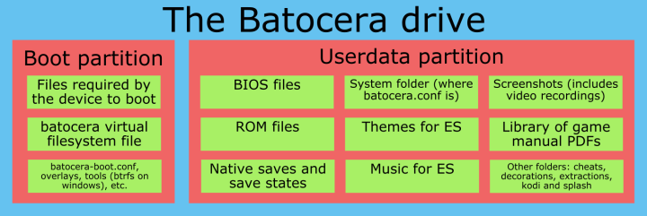
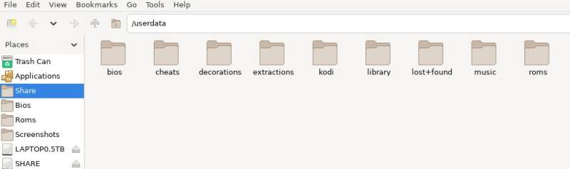
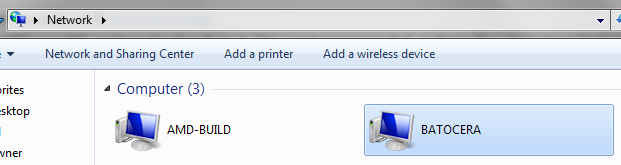
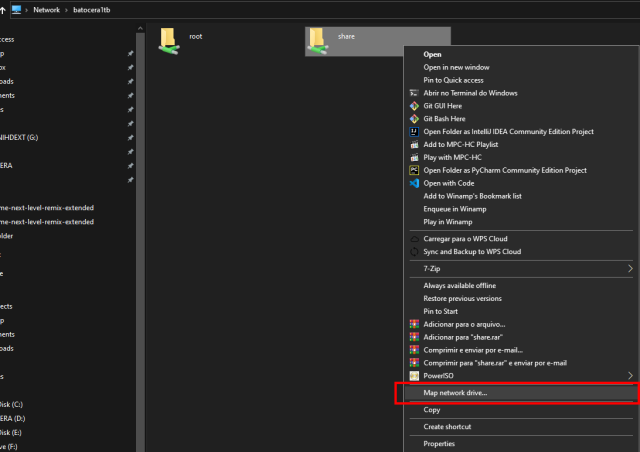
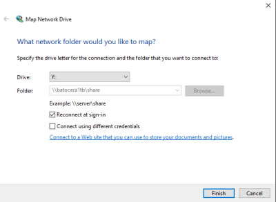
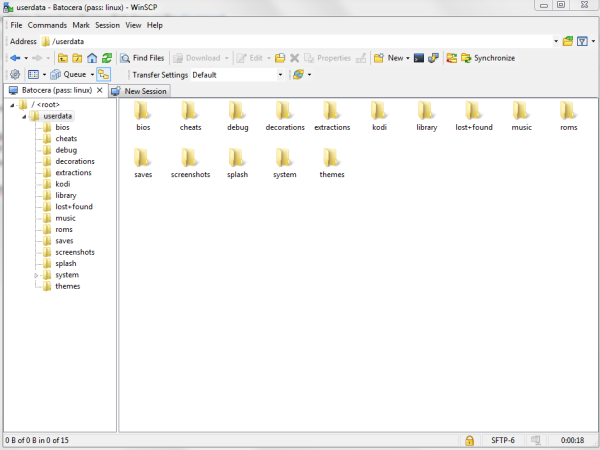
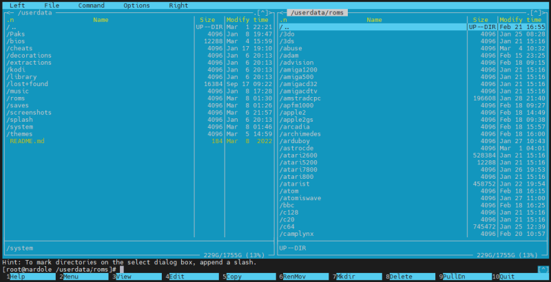
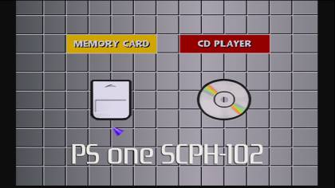

# Add games BIOS files to Batocera

Batocera는 ROM이 설치된 시스템만 표시합니다. 다양한 시스템에 더 많은 ROM이 추가되면 더 많은 시스템이 표시됩니다. 게임 목록을 업데이트하려면 [START]를 누르고 **GAME SETTINGS** → **UPDATE GAMELISTS**로 이동하세요.

Batocera에는 무료 ROM(무료로 사용할 수 있고 합법적으로 배포할 수 있는 게임)이 함께 제공됩니다. [컨텐츠 다운로더](https://wiki.batocera.org/updates_and_downloads)에서 추가 무료 게임을 설치할 수도 있습니다. 모든 아트워크는 비디오 미리보기를 포함하여 테마와 함께 사용하기 위해 미리 스크랩되어 있습니다. 이는 모든 것이 올바르게 작동하는지 테스트하는 데 사용할 수 있습니다. 자신만의 ROM과 BIOS 파일을 추가하려면 계속 읽어보세요.

> 대규모 ROM 세트가 있고 필요하지 않은 중복/언어를 줄이려면 [Unexpectpanda의 재구성 유틸리티](https://github.com/unexpectedpanda/retool)와 함께 [​​Romulus](https://romulus.dats.site/)와 같은 외부 도구를 사용할 수 있습니다. 특히 아케이드 게임의 경우 먼저 [전용 아케이드 가이드](https://wiki.batocera.org/arcade)를 읽어보는 것이 좋습니다. 그런 다음 Voljega의 BestArcade와 같은 도구를 사용하여 선별된 세트를 만들 수 있습니다.
> 
> 이미 Batocera에 ROM을 복사했고 더 간단한 방법으로 작업을 줄이고 싶다면 [andrebrait의 1g1r-romset-generator](https://github.com/andrebrait/1g1r-romset-generator)와 같은 Batocera 내부에서 실행할 수 있는 도구를 대신 사용할 수 있습니다. [시작하기 가이드](https://github.com/andrebrait/1g1r-romset-generator/wiki/Getting-started)의 지침에 따라 Batocera의 네트워크 공유 폴더에 스크립트를 설치하고 [SSH를 통해](https://wiki.batocera.org/access_the_batocera_via_ssh) 명령을 실행하세요. [ARRM](http://jujuvincebros.fr/telechargements2/file/10-arrm-another-recalbox-roms-manager) 또는 [RobG66의 Gamelist Manager](https://github.com/RobG66/Gamelist-Manager)를 사용하여 일괄 게임 목록 편집을 수행하는 것도 가능합니다.
> 
> Retrobat에서 오시는 경우 프로세스를 자동화할 수 있는 [커뮤니티 스크립트](https://github.com/soaresden/RetroBatocera-Mover)가 있습니다. 그러나 대부분의 폴더는 프로젝트 간에 동일합니다.

# 파일 추가를 위해 Batocera의 드라이브에 액세스
자신의 ROM 및 BIOS 파일을 추가하려면 먼저 Batocera의 사용자 데이터 [파티션](https://wiki.batocera.org/batocera.linux_architecture)(**SHARE**로 표시됨)에 액세스할 수 있는 방법을 얻어야 합니다. 이 인포그래픽에서 볼 수 있듯이 이는 부팅 파티션과 별개입니다.  
  

**SHARE**에 대한 액세스 권한을 얻으면 아래 [BIOS](https://wiki.batocera.org/add_games_bios#adding_bios_files) 및 [ROM](https://wiki.batocera.org/add_games_bios#adding_roms) 섹션을 참조하십시오.

Batocera는 세 가지 범주로 분류할 수 있는 드라이브에 액세스하는 다양한 방법을 수용합니다:
- [Batocera가 실행되는 동안 데이터 전송](https://wiki.batocera.org/add_games_bios#while_batocera_is_running)(대부분의 상황에서 가장 쉬운 방법)
- [다른 컴퓨터에서 Batocera 드라이브로 직접 복사](https://wiki.batocera.org/add_games_bios#copying_directly_from_another_os) 그리고
- 외부 저장소를 사용합니다.

## Batocera가 실행되는 동안
이러한 각 방법을 사용하려면 먼저 Batocera를 실행해야 합니다. 이 글머리 기호 목록에 나열된 방법 중 하나를 선택할 수 있지만 모든 방법을 한 번에 수행할 필요는 없습니다.

- PC(x86, x86_64), RPi4 및 Retroid Pocket 5/Mini 플랫폼에서는 [내장된 파일 관리자](https://wiki.batocera.org/built_file_manager)(게임 목록이 아닌 시스템 목록에 있는 동안 키보드의 [F1])를 열고 Batocera 시스템 자체를 사용하여 데이터를 전송합니다. 예. 모든 ROM을 USB 드라이브에 넣고 실행 중인 Batocera 시스템에 연결한 후 복사하세요.

- 포트 시스템에서 컨트롤러 친화적인 OD-Commander를 열고 Batocera 시스템 자체를 사용하여 데이터를 전송합니다. 예. 모든 ROM을 USB 드라이브에 넣고 실행 중인 Batocera 시스템에 연결한 후 복사하세요.
- Batocera가 실행되는 동안 네트워크 공유를 통해 다른 컴퓨터에서 추가하세요. 이 공유는 기본적으로 켜져 있으므로 Batocera에서는 아무 작업도 수행할 필요가 없습니다. 다른 컴퓨터에서 연결하려면:  
  1. 선택한 파일 탐색기를 열고 "네트워크" 섹션을 찾으세요. Android를 사용하는 경우 [CX File Explorer](https://play.google.com/store/apps/details?id=com.cxinventor.file.explorer)는 이를 지원하는 무료 앱입니다.
  2. **BATOCERA** 장치를 찾아 "공유" 폴더로 들어갑니다. 표시되지 않으면 주소 표시줄에 **\\BATOCERA\share**(Windows 또는 MacOS의 경우) 또는 **smb://BATOCERA.local/share**(Linux의 경우)를 직접 입력하여 직접 탐색하세요. 라우터가 호스트 이름을 제대로 지원하지 않는 경우(많은 기존 라우터는 지원하지 않음) 호스트 이름 대신 Batocera 시스템의 IP 주소를 입력합니다(예: **\\192.168.1.2\share**). **MAIN MENU** → **NETWORK SETTINGS** → **IP ADDRESS** 에서 Batocera의 IP 주소를 찾을 수 있습니다.
   
      > 네트워크 공유에 액세스하는 데 문제가 있는 경우 [네트워크 문제 페이지](https://wiki.batocera.org/network_issues#i_can_t_access_the_batocera_network_share_to_add_my_roms)를 확인하세요.

      > BATOCERA가 "네트워크" 섹션에 표시되지 않지만 호스트 이름을 통해 계속 액세스할 수 있는 경우 해당 네트워크 위치에 대한 영구 바로가기를 생성할 수 있습니다:
        - on Windows:
       1. “이 컴퓨터”를 열고 빈 공간을 마우스 오른쪽 버튼으로 클릭합니다. **네트워크 위치 추가를 선택**합니다.
       2. **다음**을 두 번 클릭합니다.
       3. Batocera 공유에 액세스할 수 있는 주소를 입력하고 **다음**을 클릭하세요.
       4. 원하는 경우 바로가기에 사용자 정의 이름을 지정한 후 **다음**을 다시 클릭하세요.
       5. **마침**을 클릭하면 네트워크 위치가 이제 **이 컴퓨터**에 나타납니다.
          
        - on Linux:
       1. 원하는 파일 관리자를 엽니다.
       2. 일반적으로 수행되는 방식으로 네트워크 공유를 마운트합니다.
       3. 공유가 사이드바에 나타나야 합니다. 마우스 오른쪽 버튼을 클릭하고 "북마크" 또는 "핀"에 해당하는 항목을 선택하세요.
       4. 이제 사이드바에서 공유를 항상 사용할 수 있습니다..
          - 대신 호스트 이름 자체를 네트워크 드라이브로 매핑하려면  
            **On Windows:**
              1. `\\BATOCERA`로 이동합니다(호스트 이름이 작동하지 않고 여전히 이 방법을 사용하려는 경우 여기에 IP 주소를 입력할 수 있지만 라우터에서 Batocera에 고정 IP 주소를 할당해야 하며 이는 이 가이드의 범위를 벗어납니다).
               2. Batocera의 "공유" 공유를 마우스 오른쪽 버튼으로 클릭하세요.
               3. **Map Network Drive…** 선택 
               4. 드라이브 문자를 선택하고 **Finish**를 눌러 확인합니다. 
               5. Batocera의 'SHARE'에 매핑된 드라이브는 이제 **이 컴퓨터**에서 사용할 수 있습니다. 

            **On Linux:**  
              1. OS에 대해 "fstab"을 검색하세요.
  
- [WinSCP](https://wiki.batocera.org/winscp)를 사용하여 SSH/SFTP를 통해 다른 컴퓨터에서 Batocera 시스템으로 전송.
  
- 내장된 파일 관리자 대신 [Midnight Commander](https://midnight-commander.org/)를 SSH 터미널에서 사용하여 파일을 복사할 수 있습니다. 사용하려면 [SSH를 통해 로그인](https://wiki.batocera.org/access_the_batocera_via_ssh)하고 `mc`를 실행하세요.
  
- SSH/터미널에 대한 방법을 알고 있다면 `cp` 및 `mv` 명령을 직접 사용할 수도 있습니다..

## 다른 OS에서 직접 복사
이는 Batocera 드라이브를 다른 시스템(또는 동일한 시스템의 다른 OS)에 연결하고 거기에서 `SHARE` 파티션으로 직접 파일을 복사하는 것입니다.

  > 이러한 방법 중 하나를 사용하는 경우 Batocera를 한 번 이상 부팅하여 사용자 데이터 파티션을 자동 확장하여 드라이브의 나머지 부분을 채울 수 있도록 하십시오. 그렇지 않으면 크기가 512MB에 불과합니다!

  -  기본적으로 ext4 파일 시스템에 쓸 수 있는 컴퓨터의 **사용자 데이터** 파티션에 ROM/BIOS 파일을 직접 복사합니다(ext4 파일 시스템을 지원하는 모든 OS가 작동해야 함).
     - Batocera 드라이브가 연결되면 두 개의 파티션이 나타납니다. 하나는 `BATOCERA`라는 레이블이 붙은 부팅 파티션이고 다른 하나는 `SHARE`라는 레이블이 붙은 사용자 데이터 파티션입니다. [게임/BIOS](https://wiki.batocera.org/add_games_bios#adding_roms) 파일을 `SHARE` 파티션에 적절하게 복사하세요. Windows는 기본적으로 Linux 형식의 파일 시스템을 읽을 수 없습니다. 사용자 데이터를 더 간단한 파일 시스템으로 다시 포맷하거나 Windows에 비공식 드라이버를 추가하거나(아래 설명 참조) 더 강력한 OS를 사용하십시오.
      > In Windows:      
      > Linux 형식의 파티션과 상호 작용할 때 Windows/iOS가 데이터를 성공적으로 복사하지 못해 파일이 사라지는 등 이상한 문제가 발생한다는 사용자 보고가 있다는 점에 유의하세요. 대부분의 사용자에게 이는 문제가 되지 않습니다. 의심스러운 경우 [Batocera 자체를 사용하여 실행 중에 데이터를 복사](https://wiki.batocera.org/add_games_bios#while_batocera_is_running)하십시오.  
      > 간단한 솔루션을 위해 [Disk Genius](https://www.diskgenius.com/)를 사용하여 [ext4 파티션을 읽고 쓸 수 있습니다](https://www.diskgenius.com/how-to/ext4-windows.php#Read_write_EXT4_partition_in_Windows). 무료 평가판에서는 "작은" 파일만 복사할 수 있습니다.  
      > 또는 [Ext4Fsd](https://github.com/bobranten/Ext4Fsd)와 같은 ext4 Windows 시스템 드라이버를 설치할 수 있습니다. 불안정한 커널 드라이버이므로 주의해서 사용하고 항상 데이터를 백업하십시오. 또는 이 [프랑스어 페이지](https://www.dsfc.net/infrastructure/stockage-infrastructure/lire-partitions-ext2-ext3-ext4-sous-windows/)의 모듈 중 하나를 사용하세요.  
      > - WSL2를 사용하여 Windows 11에서 ext4 파티션 마운트  
      >   - 서문에 따르면 Windows에서 손상된 기능을 수정하기 위해 이 정도까지 진행하는 경우 VM에 Ubuntu를 설치하고 게스트 추가를 활성화하여 끌어서 놓기를 허용할 수도 있습니다. 훨씬 더 간단할 것입니다.
      >   - Windows 11(또는 Windows 10 Insider Build 20211) 이상을 사용하는 경우 [WSL 2 기능을 통해 ext4 파일 시스템을 마운트](https://devblogs.microsoft.com/commandline/access-linux-filesystems-in-windows-and-wsl-2/)할 수 있습니다(이를 위해서는 WSL2에 Linux 배포판을 설치해야 하며 [버그로 인해 플래시 드라이브로 감지된 장치를 읽을 수 없습니다](https://github.com/microsoft/WSL/issues/6011)):  
      >     1. 관리자 권한으로 PowerShell 창 열기
      >     2. WSL이 현재 비활성화된 경우:  
      >       a. `Enable-WindowsOptionalFeature -Online -FeatureName Microsoft-Windows-Subsystem-Linux`를 입력하고 [Enter] 키를 누릅니다.  
      >       b. 메시지가 나타나면 컴퓨터를 다시 시작하세요.  
      >       c. 관리자 권한으로 Powershell을 다시 엽니다.
      >       d. WSL2에 Linux 배포판을 설치합니다. 이는 `wsl --install --distribution Ubuntu`를 입력하고 [Enter]를 눌러 수행할 수 있습니다.
      >     3. `wmic diskdrive list Brief`를 입력하고 [Enter] 키를 눌러 현재 마운트할 수 있는 모든 디스크를 나열합니다.
      >       
      >     4. 그런 다음 `wsl --mount <DiskPath>`(여기서 <DiskPath>는 원하는 디스크로 대체됩니다(예: `wsl --mount \\.\PHYSICALDRIVE1`))를 입력하고 [Enter]를 다시 누릅니다.
      >     5. 이제 파티션이 "Linux" 그룹 아래의 파일 탐색기 사이드바에 나타납니다(또는 수동으로 `\wsl$`로 이동).
      >     6. 디스크를 마운트 해제하려면 `wsl --unmount <Diskpath>`를 입력하세요.

      > In MacOS:  
      > MacOS를 사용하는 경우 네트워크 전송 방법을 사용하는 것이 좋습니다(다음 글머리 기호에서 언급된 가상 머신 방법이 이어짐). MacOS의 내부 작동 방식에 이미 익숙하고, 이전에 해당 소스에서 소프트웨어를 구축한 적이 있고, 시스템을 자체 제작했으며, 시스템에 불안정성을 도입해도 괜찮다면 ext4 파티션을 읽는 기본 솔루션을 사용할 수 있습니다. [fuse-ext2](https://github.com/alperakcan/fuse-ext2)가 포함된 [macFUSE](https://osxfuse.github.io/)를 사용하여 ext4 파티션을 읽고 쓸 수 있습니다. 매우 간단한 가이드(`이것은 테스트되지 않았습니다. 적절한 방법을 알고 싶다면` [Github 페이지](https://github.com/alperakcan/fuse-ext2)`를 참조하고 마지막으로 드라이버의 말을 인용하십시오.` "이것은 실험적인 코드입니다. rw에서 실제 파일 시스템을 여는 것은 데이터에 위험할 수 있습니다. 파일 시스템 이미지를 읽기 전용 모드로 열려면 "-o ro"를 추가하고, 이 모듈을 테스트하는 위험을 감수하려면 "-o rw"를 추가하십시오."):  
      > 1. 시스템에 Homebrew를 설치합니다. 이것은 어차피 일반 사용자를 위한 것이 아니라 그 자체의 시련이므로 다루지 않을 것입니다.
      > 2. macfuse 설치: `Brew install --cask macfuse`
      > 3. fuse-ext2 설치: [brew method](https://apple.stackexchange.com/questions/226981/how-do-i-install-fuse-ext2-to-use-with-osxfuse) 또는 [manual compilation](https://github.com/alperakcan/fuse-ext2#macos)
      > 4. Discover which disk it is that contains the Batocera userdata: `diskutil list`
      > 5. Mount the disk (where `/tmp/test-fs.ext4` is the path to the disk desired):
      >     ```js
      >     /opt/gnu/sbin/mkfs.ext4 /tmp/test-fs.ext4
      >     mkdir -p ~/mnt/fuse-ext2.test-fs.ext4
      >     fuse-ext2 /tmp/fuse-ext2.test-fs.ext4 ~/mnt/fuse-ext2.test-fs.ext4 -o rw+,allow_other,uid=501,gid=20
      >     ```

  - 가상 머신과 호스트 시스템 간의 전송을 허용하는 플러그인과 함께 기본적으로 ext4 파일 시스템을 읽을 수 있는 OS의 가상 머신을 사용하십시오. [Oracle Virtualbox](https://www.oracle.com/virtualization/technologies/vm/downloads/virtualbox-downloads.html), [VMWare](https://www.vmware.com/products/workstation-pro/workstation-pro-evaluation.html) 및 Windows Pro 또는 상위 버전이 있는 경우 [내장된 가상 머신 도구인 Hyper-V](https://www.lifewire.com/how-to-create-virtual-machine-windows-10-4770680)를 사용하세요.
  - 사용자 데이터 파티션을 NTFS 또는 exFAT와 같은 더 많은 OS와 호환되는 이전 파일 시스템으로 [포맷](https://wiki.batocera.org/batocera.linux_architecture#using_an_alternative_filesystem_for_userdata)하고 파일을 직접 복사하십시오. [해당 파일 시스템에는 제한](https://wiki.batocera.org/batocera.linux_architecture#using_an_alternative_filesystem_for_userdata)이 있으므로 이는 권장되지 않습니다.
  - Batocera 5.26 이상에서는 사용자 데이터 파티션을 BTRFS로 [포맷](https://wiki.batocera.org/batocera.linux_architecture#using_an_alternative_filesystem_for_userdata)하고 직접 전송하십시오.
  > Windows에서는 Batocera 드라이브의 `tools/` 폴더에서 btrfs_for_windows 드라이버를 설치할 수 있습니다. 설치 방법은 Readme를 확인하세요. [보안 부팅을 사용하는 경우 추가 해결 방법이 필요](https://github.com/maharmstone/btrfs#secureboot)합니다.
  > 
  > "최신 버전의 Windows 10의 경우 Microsoft는 오픈 소스 드라이버에서는 사용할 수 없는 것처럼 보이는 서명에 대한 더 부담스러운 요구 사항을 도입했습니다. 이 문제를 해결하려면 Regedit에서 `HKEY_LOCAL_MACHINE\SYSTEM\CurrentControlSet\Control\CI\Policy`로 이동하여 `UpgradedSystem`이라는 새 DWORD 값을 생성하고 1로 설정한 다음 재부팅하세요. 아니면 언제든지 BIOS에서 보안 부팅을 끌 수도 있습니다. 설정.”

## 외부 저장소 사용
또는 Batocera에 외부 저장소를 사용하도록 명령하여 Batocera의 내부 드라이브에 모두 함께 액세스할 필요를 건너뛸 수 있습니다.
- [저장을 위해 외부 드라이브를 사용](https://wiki.batocera.org/store_games_on_a_second_usb_sata_drive)하십시오. [파일 시스템에 대한 동일한 제한 사항](https://wiki.batocera.org/batocera.linux_architecture#using_an_alternative_filesystem_for_userdata)이 여전히 적용되지만 이를 사용하면 다른 파일 시스템으로 다시 포맷하기가 더 쉽습니다.
- [NAS(네트워크 액세스 스토리지)를 사용](https://wiki.batocera.org/store_games_on_a_nas)합니다. 파일 시스템에 대한 동일한 제한 사항이 여전히 적용되지만 이를 사용하면 다른 파일 시스템으로 다시 포맷하기가 더 쉽습니다.

# BIOS 파일 추가
BIOS 파일은 일부 에뮬레이터가 올바르게 작동하는 데 필요한 파일입니다. 예를 들어, 일부 PlayStation 및 NeoGeo 게임이 작동하려면 BIOS 파일이 필요합니다.



이들 모두는 `SHARE` 파티션의 `bios/` 폴더에 들어갑니다.

> BIOS 파일은 저작권으로 보호되므로 Batocera에 포함되어 있지 않습니다. 합법적으로 배포할 수 없으므로 직접 제공해야 합니다.

아케이드 게임은 어떻습니까? 아케이드 에뮬레이터의 경우 조금 더 복잡합니다. 많은 아케이드 보드가 하나의 특정 게임 또는 몇 가지 게임용으로 설계되었습니다. 대부분의 경우 BIOS 파일은 필요하지 않지만 [이 페이지에 설명된 대로 특정 추가 파일이 필요](https://wiki.batocera.org/arcade)할 수 있습니다. Atomiswave 또는 Naomi와 같은 다른 아케이드 시스템의 경우 아래 나열된 적절한 BIOS 파일이 필요합니다.

## 적합한 BIOS 파일 목록
BIOS 파일의 체크섬을 가져오는 `md5sum` 명령이지만 가장 쉬운 방법은 **SYSTEM SETTINGS** 메뉴에서 **MISSING BIOS**를 확인하는 것입니다. 그러면 각 시스템에 필요한 모든 BIOS 파일의 필수 경로와 md5sum이 표시됩니다. 현재 버전의 Batocera가 설치되어 있으면 항상 최신 상태로 유지됩니다.

에뮬레이트된 시스템에 필요한 BIOS 파일의 텍스트 문서는 `bios/readme.txt`에서 찾을 수 있습니다. 빠르게 스크롤하려면 [터미널 명령](https://wiki.batocera.org/access_the_batocera_via_ssh) `more /usr/share/batocera/datainit/bios/readme.txt`를 사용하십시오(스크롤하려면 [Space], 종료하려면 [Q]).

BIOS 검사기 도구 자체는 `batocera-systems`에서 자체적으로 실행될 수 있습니다(처리하는 데 시간이 걸리며 1~2분 정도 소요됩니다). "누락된" BIOS 파일이 모두 필요한 것은 아닙니다. 대부분의 에뮬레이터는 해당 파일 없이도 실행되며, 플레이할 의도가 없는 시스템에는 BIOS 파일이 필요하지 않습니다.

[Github 리포지토리](https://github.com/batocera-linux/batocera.linux/blob/master/package/batocera/core/batocera-scripts/scripts/batocera-systems)에서 직접 필수 BIOS 파일과 곧 구현될 BIOS 파일의 현재 목록을 찾을 수 있습니다.

다음은 Batocera v36에 대해 마지막으로 업데이트된 시스템당 호환 가능한 [md5 및 파일 이름 목록](https://wiki.batocera.org/add_games_bios)입니다

# ROM 추가
`roms/` 폴더에는 플랫폼에서 사용 가능한 모든 시스템에 대한 모든 폴더가 포함되어 있습니다. 더 많은 폴더를 추가해도 시스템은 Batocera에 추가되지 않습니다. 해당 시스템의 폴더가 없으면 해당 시스템의 에뮬레이터가 플랫폼에 없는 것입니다.

자신의 ROM을 설치할 때 사용할 에뮬레이터에 적합한 형식인지 확인하십시오. 예를 들어 NES ROM을 추가하려는 경우 ROM 파일 확장자가 `roms/nes/_info.txt` 파일에 나열되어 있는지 확인하십시오. 이 특정 시스템의 경우 허용되는 ROM 형식은 `.7z .nes .zip`이므로 허용되는 게임은 `beans.nes`입니다. 기본적으로 각 ROM 시스템 디렉터리에는 하나의 `_info.txt` 파일이 있습니다. 새로운 시스템이 출시되면 새로운 `_info.txt` 파일이 추가됩니다. 각 시스템에 대한 설명 이름은 [시스템 페이지](https://wiki.batocera.org/systems)에서 확인할 수 있습니다.

기본적으로 Batocera는 시스템 목록의 드라이브에 ROM이 없는 시스템을 숨깁니다. 올바른 형식의 ROM이 해당 폴더에 추가되고 게임 목록이 새로 고쳐지면 새 시스템이 나타납니다.

하나의 시스템에 여러 에뮬레이터를 사용할 수 있지만 모든 에뮬레이터가 동일한 ROM 형식을 허용하지 않는 경우, 호환되지 않는 형식으로 게임을 시작하려고 하면 선택한 에뮬레이터에서 ROM을 사용할 수 없다는 메시지가 표시됩니다. 적어도 대부분의 경우. 확실하지 않다면 앞서 언급한 `_info.txt` 파일을 참고하세요.