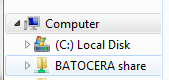

# Add games BIOS files to Batocera

Batocera는 ROM이 설치된 시스템만 표시합니다. 다양한 시스템에 더 많은 ROM이 추가되면 더 많은 시스템이 표시됩니다. 게임 목록을 업데이트하려면 [START]를 누르고 **GAME SETTINGS** → **UPDATE GAMELISTS**로 이동하세요.

Batocera에는 무료 ROM(무료로 사용할 수 있고 합법적으로 배포할 수 있는 게임)이 함께 제공됩니다. [컨텐츠 다운로더](https://wiki.batocera.org/updates_and_downloads)에서 추가 무료 게임을 설치할 수도 있습니다. 모든 아트워크는 비디오 미리보기를 포함하여 테마와 함께 사용하기 위해 미리 스크랩되어 있습니다. 이는 모든 것이 올바르게 작동하는지 테스트하는 데 사용할 수 있습니다. 자신만의 ROM과 BIOS 파일을 추가하려면 계속 읽어보세요.

> 대규모 ROM 세트가 있고 필요하지 않은 중복/언어를 줄이려면 [Unexpectpanda의 재구성 유틸리티](https://github.com/unexpectedpanda/retool)와 함께 [​​Romulus](https://romulus.dats.site/)와 같은 외부 도구를 사용할 수 있습니다. 특히 아케이드 게임의 경우 먼저 [전용 아케이드 가이드](https://wiki.batocera.org/arcade)를 읽어보는 것이 좋습니다. 그런 다음 Voljega의 BestArcade와 같은 도구를 사용하여 선별된 세트를 만들 수 있습니다.
> 
> 이미 Batocera에 ROM을 복사했고 더 간단한 방법으로 작업을 줄이고 싶다면 [andrebrait의 1g1r-romset-generator](https://github.com/andrebrait/1g1r-romset-generator)와 같은 Batocera 내부에서 실행할 수 있는 도구를 대신 사용할 수 있습니다. [시작하기 가이드](https://github.com/andrebrait/1g1r-romset-generator/wiki/Getting-started)의 지침에 따라 Batocera의 네트워크 공유 폴더에 스크립트를 설치하고 [SSH를 통해](https://wiki.batocera.org/access_the_batocera_via_ssh) 명령을 실행하세요. [ARRM](http://jujuvincebros.fr/telechargements2/file/10-arrm-another-recalbox-roms-manager) 또는 [RobG66의 Gamelist Manager](https://github.com/RobG66/Gamelist-Manager)를 사용하여 일괄 게임 목록 편집을 수행하는 것도 가능합니다.
> 
> Retrobat에서 오시는 경우 프로세스를 자동화할 수 있는 [커뮤니티 스크립트](https://github.com/soaresden/RetroBatocera-Mover)가 있습니다. 그러나 대부분의 폴더는 프로젝트 간에 동일합니다.

# 파일 추가를 위해 Batocera의 드라이브에 액세스
자신의 ROM 및 BIOS 파일을 추가하려면 먼저 Batocera의 사용자 데이터 [파티션](https://wiki.batocera.org/batocera.linux_architecture)(**SHARE**로 표시됨)에 액세스할 수 있는 방법을 얻어야 합니다. 이 인포그래픽에서 볼 수 있듯이 이는 부팅 파티션과 별개입니다.  
  

**SHARE**에 대한 액세스 권한을 얻으면 아래 [BIOS](https://wiki.batocera.org/add_games_bios#adding_bios_files) 및 [ROM](https://wiki.batocera.org/add_games_bios#adding_roms) 섹션을 참조하십시오.

Batocera는 세 가지 범주로 분류할 수 있는 드라이브에 액세스하는 다양한 방법을 수용합니다:
- [Batocera가 실행되는 동안 데이터 전송](https://wiki.batocera.org/add_games_bios#while_batocera_is_running)(대부분의 상황에서 가장 쉬운 방법)
- [다른 컴퓨터에서 Batocera 드라이브로 직접 복사](https://wiki.batocera.org/add_games_bios#copying_directly_from_another_os) 그리고
- 외부 저장소를 사용합니다.

## Batocera가 실행되는 동안
이러한 각 방법을 사용하려면 먼저 Batocera를 실행해야 합니다. 이 글머리 기호 목록에 나열된 방법 중 하나를 선택할 수 있지만 모든 방법을 한 번에 수행할 필요는 없습니다.

- PC(x86, x86_64), RPi4 및 Retroid Pocket 5/Mini 플랫폼에서는 [내장된 파일 관리자](https://wiki.batocera.org/built_file_manager)(게임 목록이 아닌 시스템 목록에 있는 동안 키보드의 [F1])를 열고 Batocera 시스템 자체를 사용하여 데이터를 전송합니다. 예. 모든 ROM을 USB 드라이브에 넣고 실행 중인 Batocera 시스템에 연결한 후 복사하세요.

- 포트 시스템에서 컨트롤러 친화적인 OD-Commander를 열고 Batocera 시스템 자체를 사용하여 데이터를 전송합니다. 예. 모든 ROM을 USB 드라이브에 넣고 실행 중인 Batocera 시스템에 연결한 후 복사하세요.
- Batocera가 실행되는 동안 네트워크 공유를 통해 다른 컴퓨터에서 추가하세요. 이 공유는 기본적으로 켜져 있으므로 Batocera에서는 아무 작업도 수행할 필요가 없습니다. 다른 컴퓨터에서 연결하려면:  
  1. 선택한 파일 탐색기를 열고 "네트워크" 섹션을 찾으세요. Android를 사용하는 경우 [CX File Explorer](https://play.google.com/store/apps/details?id=com.cxinventor.file.explorer)는 이를 지원하는 무료 앱입니다.
  2. **BATOCERA** 장치를 찾아 "공유" 폴더로 들어갑니다. 표시되지 않으면 주소 표시줄에 **\\BATOCERA\share**(Windows 또는 MacOS의 경우) 또는 **smb://BATOCERA.local/share**(Linux의 경우)를 직접 입력하여 직접 탐색하세요. 라우터가 호스트 이름을 제대로 지원하지 않는 경우(많은 기존 라우터는 지원하지 않음) 호스트 이름 대신 Batocera 시스템의 IP 주소를 입력합니다(예: **\\192.168.1.2\share**). **MAIN MENU** → **NETWORK SETTINGS** → **IP ADDRESS** 에서 Batocera의 IP 주소를 찾을 수 있습니다.
   
      > 네트워크 공유에 액세스하는 데 문제가 있는 경우 [네트워크 문제 페이지](https://wiki.batocera.org/network_issues#i_can_t_access_the_batocera_network_share_to_add_my_roms)를 확인하세요.

      > BATOCERA가 "네트워크" 섹션에 표시되지 않지만 호스트 이름을 통해 계속 액세스할 수 있는 경우 해당 네트워크 위치에 대한 영구 바로가기를 생성할 수 있습니다:
        - on Windows:
       1. “이 컴퓨터”를 열고 빈 공간을 마우스 오른쪽 버튼으로 클릭합니다. **네트워크 위치 추가를 선택**합니다.
       2. **다음**을 두 번 클릭합니다.
       3. Batocera 공유에 액세스할 수 있는 주소를 입력하고 **다음**을 클릭하세요.
       4. 원하는 경우 바로가기에 사용자 정의 이름을 지정한 후 **다음**을 다시 클릭하세요.
       5. **마침**을 클릭하면 네트워크 위치가 이제 **이 컴퓨터**에 나타납니다.
          
        - on Linux:
       1. 원하는 파일 관리자를 엽니다.
       2. 일반적으로 수행되는 방식으로 네트워크 공유를 마운트합니다.
       3. 공유가 사이드바에 나타나야 합니다. 마우스 오른쪽 버튼을 클릭하고 "북마크" 또는 "핀"에 해당하는 항목을 선택하세요.
       4. 이제 사이드바에서 공유를 항상 사용할 수 있습니다..
        

          
대신 호스트 이름 자체를 네트워크 드라이브로 매핑하려면

          test
        

# BIOS 파일 추가

# ROM 추가