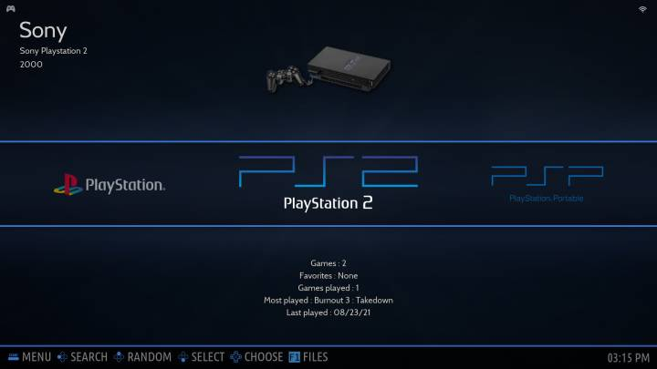
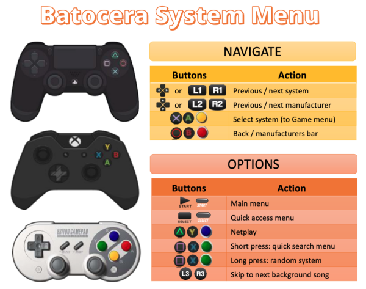
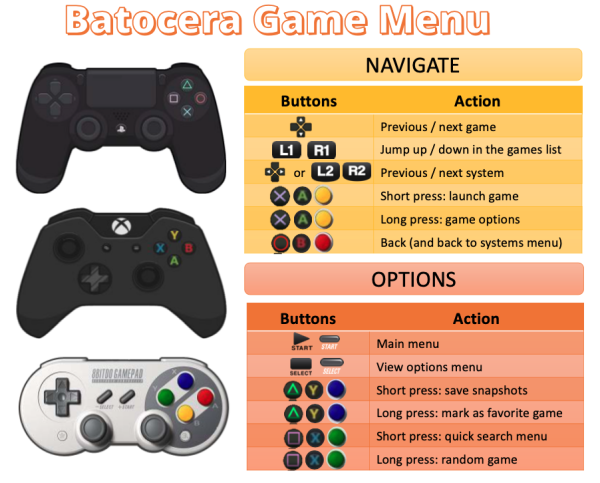
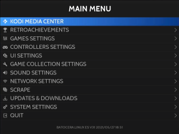
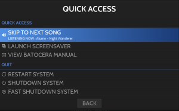
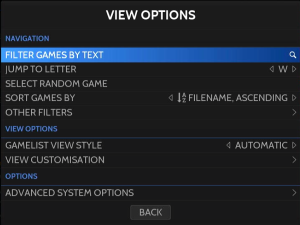
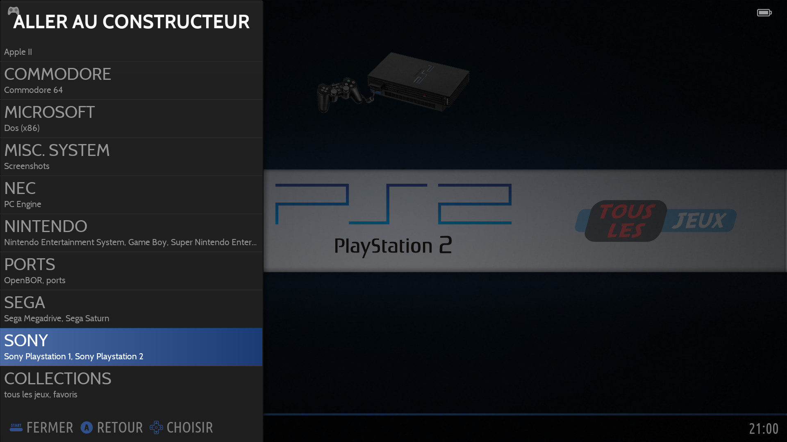
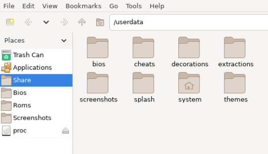
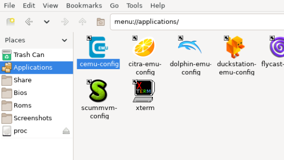

# Emulation Station
에뮬레이터 팬인 게이머는 동일한 문제를 계속해서 직면하는 경향이 있습니다. 디스크에 있는 수백 개의 에뮬레이터와 수천 개의 ROM을 어떻게 구성합니까? 이는 특히 관련된 데이터 정렬의 다양한 형식과 방법을 모두 고려할 때 평범한 작업이 됩니다. 이 문제를 해결하고 에뮬레이터가 너무 지저분해지는 것을 방지하기 위해 EmulationStation(약칭 ES)은 모든 것을 한 곳에 모았습니다. 이는 오늘날 최고의 인터페이스 중 하나를 갖춘 프런트 엔드입니다. [설정하는 과정은 지루할 수 있지만](https://wiki.batocera.org/add_games_bios) 결과는 그만한 가치가 있습니다.

## 메뉴 사용법
EmulationStation에는 특정 버튼에 매핑된 여러 가지 공통 기능이 있습니다. 모든 사람이 서로 [다른 컨트롤러를 사용하고 종종 다시 매핑](https://wiki.batocera.org/configure_a_controller)하기 때문에 일반적으로 4개의 작업 버튼을 북쪽/동쪽/남쪽/서쪽이라고 부릅니다. 이는 ///으로 그래픽으로 표시됩니다. 아래 표에서 몇 가지 일반적인 ES 기능과 해당 기능이 PlayStation, Xbox 및 SNES 컨트롤러에 매핑되는 방식을 확인할 수 있습니다.

ES의 메뉴에서 표준 서부(미국의 Xbox/PS3) 방향에 따라 남쪽 버튼(키보드의 Enter)은 확인을 위한 것이고 동쪽 버튼(키보드의 Esc)은 취소하는 것입니다. 대신 **MAIN MENU** → **SYSTEM SETTINGS** → **DEVELOPER MENU** → **SWTICH A/B BUTTONS IN EMULATIONSTATION**에서 동부(일본의 Nintendo/PSX) 방향을 모방할 수 있습니다. 이 위키의 모든 지침은 서양식 방향을 사용한다고 가정합니다.

서쪽 버튼(-키보드) 및 북쪽 버튼(= 키보드)은 일반적으로 현재 화면의 상황에 따라 달라지는 유틸리티 기능에 할당됩니다. 해당 기능을 보려면 화면 하단에 있는 도움말 프롬프트를 참조하세요.

> Batocera **v30** 이하에서는 을 눌러 게임 옵션 버튼에 액세스하고(**v30**만 해당) 을 길게 눌러 상태 저장 관리자에 액세스합니다. 이 동작은 **DEVELOPER MENU** → **ACCESS GAME OPTIONS WITH NORTH BUTTON**으로 이동하여 "ON"으로 전환하여 v31 이후 버전에서 복제할 수 있습니다.

컨트롤러의 [START] 버튼(키보드의 스페이스바)을 눌러 EmulationStation의 기본 메뉴(모든 목록에서)를 불러옵니다.

메인/시스템 메뉴인지, 게임 목록인지에 따라 [SELECT] 버튼(키보드의 백스페이스)을 누르면 나타나는 메뉴가 달라집니다. 이는 **해당 시스템에 대한 시스템별 고급 설정**으로 이동하는 빠른 방법일 수 있습니다. [SELECT]를 길게 누르면 현재 게임 목록을 필터링하여 즐겨찾는 게임만 표시하고, [SELECT]를 다시 길게 누르면 전체 목록으로 돌아갑니다.

|메인 메뉴 및 게임 목록의 시작 버튼|메인 메뉴에서 버튼 선택|게임 목록에서 버튼 선택|
|:---:|:---:|:---:|
||||

> Batocera는 **QUIT** 메뉴에서도 종료(전원 끄기)할 수 있습니다.

Batocera 5.27의 새로운 기능: 시스템 목록에서 을 눌러 시스템 제조업체 표시줄에 액세스할 수 있습니다.

## 파일 관리자 및 애플리케이션 메뉴
Batocera에는 [PCManFM](https://wiki.lxde.org/en/PCManFM)이라는 간단한 [내장 파일 관리자](https://wiki.batocera.org/built_file_manager)가 있습니다. 기본 EmulationStation 메뉴에서 키보드의 [F1]을 눌러 액세스할 수 있습니다. 이는 x86/x86_64 빌드에서만 사용할 수 있습니다.

[Wii U](https://wiki.batocera.org/systems:wiiu), [PlayStation 2](https://wiki.batocera.org/systems:ps2) 또는 [PlayStation 3](https://wiki.batocera.org/systems:ps3)과 같은 시스템용으로 특정 에뮬레이터를 구성하려는 경우 사이드바에서 `애플리케이션`을 열어 에뮬레이터 설정을 찾을 수 있습니다. EmulationStation의 **시스템별 고급 설정**에 설정된 모든 설정은 실행 시 여기에서 수행한 적용 가능한 구성을 덮어쓰게 된다는 점을 명심하십시오!

> 이 인터페이스를 통해 파일을 삭제하면 기본적으로 해당 파일은 휴지통으로 이동됩니다. [Del] 대신 [Shift] [Del] 키를 눌러 이 동작을 무시하거나 기본적으로 파일 관리자 자체를 삭제하도록 구성할 수 있습니다. 파일을 휴지통으로 이동했지만 찾을 수 없는 경우 휴지통 폴더 경로는 `/userdata/system/.local/share/Trash/files`입니다.