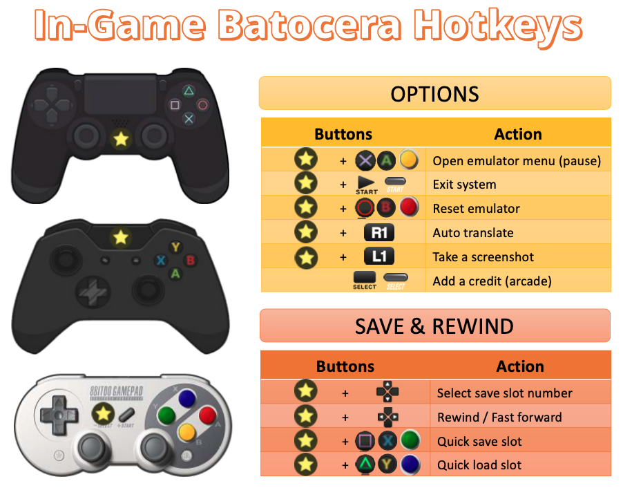

# Hotkey shortcuts

게임 중에 게임 내 상태를 저장/로드하려는 경우와 같이 패드를 사용하여 몇 가지 단축키를 실행할 수 있습니다.

플레이어 1의 컨트롤러에서 [HOTKEY] 버튼을 동시에 누르면 단축키가 호출됩니다.

기본 EmulationStation 메뉴에서 단축키를 식별할 수 있습니다. 컨트롤러에서 아무 키나 누르면 왼쪽 상단에 작은 "컨트롤러" 아이콘이 나타나 플레이어 번호를 식별할 수 있습니다. 아이콘이 다른 버튼과 다른 색상으로 변하면 단축키를 눌렀다는 의미입니다. 이 아이콘은 사용 중인 테마에 따라 사용자 정의할 수 있으며 일부는 대체 마커를 구현했습니다.

[SELECT] 또는 Xbox 가이드나 PlayStation 홈 버튼과 같이 패드의 사용하지 않는 버튼에 단축키를 할당할 수 있습니다.

> 단축키를 다른 키에 할당하면 해당 단축키가 즉시 실행됩니다. 예를 들어 [START]를 단축키로 할당하면 [START]를 누르면 에뮬레이터가 즉시 종료됩니다.

널리 사용되는 컨트롤러의 예는 아래 그림을 참조하세요:

|단축키|행동|
|:---:|---|
||에뮬레이터 메뉴 열기(사용 가능한 경우)|
|[START]|에뮬레이터를 종료하고 메뉴로 돌아가기|
||에뮬레이트된 시스템에 재설정 명령 전송(사용 가능한 경우)|
|[L1]|에뮬레이터 내 스크린샷/해당 에뮬레이터와 관련된 내용 스샷|
|[R1]|자동 번역/해당 에뮬레이터와 관련된 내용|
|[L2]/[R2]|해당 에뮬레이터에 특정한 셰이더/항목 선택|
|D-pad up/down|현재 저장 슬롯 선택|
|D-pad left/right|되감기(활성화된 경우)/빨리 감기(사용 가능한 경우)|
||현재 슬롯에 ​​상태 저장|
||현재 슬롯에서 상태 로드|
|||

이는 에뮬레이터의 100%에서 작동하지 않습니다. 대부분 Libretro 에뮬레이터에서 잘 작동하지만 아키텍처 및 옵션에 따라 달라질 수도 있습니다. Batocera는 모든 에뮬레이터에서 가능한 한 일관적인 단축키를 만들려고 시도했지만 모든 에뮬레이터가 모든 기능을 지원하는 것은 아니며 일부는 동일한 단축키 조합으로 다르게 작동합니다.

또한 [RetroAchievements](https://wiki.batocera.org/retroachievements_settings)를 사용하는 동안 이러한 단축키 조합을 통해 게임 내 진행 상황을 저장/로드하려면 RetroAchievements 설정을 **HARDCORE** 모드로 설정하지 않았는지 확인하세요. 하드코어 모드에서는 이러한 저장/로드 기능을 사용할 수 없기 때문입니다.

Batocera의 프런트엔드 메뉴 탐색에 대해 자세히 알아보려면 전용 [EmulationStation 개요 페이지](https://wiki.batocera.org/emulationstation_overview)를 참조하세요.